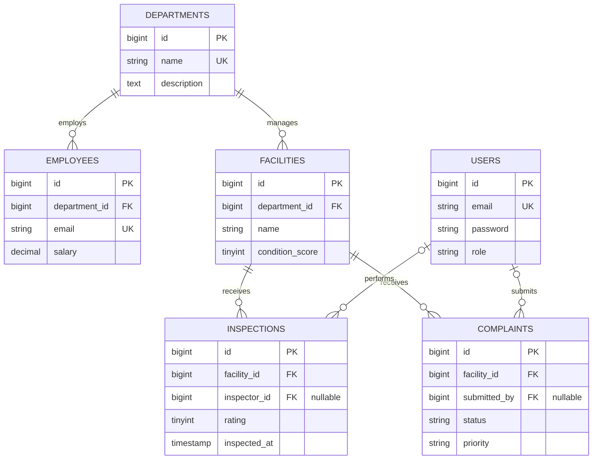

# Database relationships

- Deleting a department is restricted while it has employees or facilities.
- Deleting a facility is restricted while it has inspections or complaints; the API returns `409 Conflict` for this case.
- Deleting a user sets the optional inspection/complaint user reference to `NULL`, preserving records.
- Indexes cover employee department/salary, facility condition score, inspection facility/date, and complaint facility/status queries.

The Laravel migrations under `../laravel-api/database/migrations/` define the executable schema.
