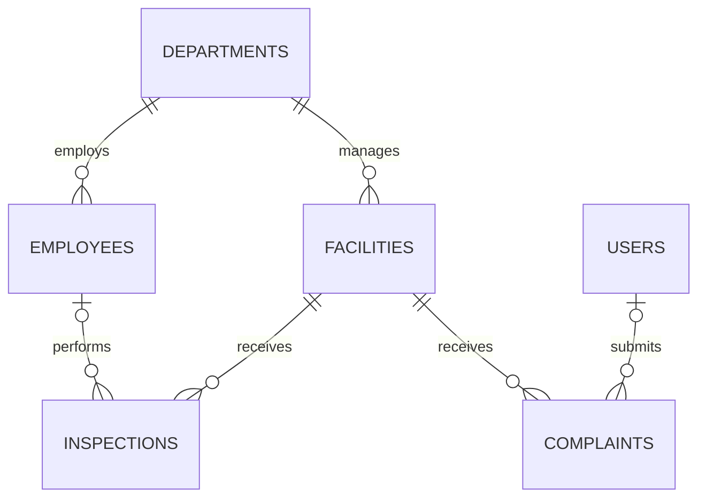

# FacilityOps database relationships

`schema.sql` creates the executable MySQL schema. Foreign keys restrict deleting departments or facilities with dependent records. Optional user references become null if a user is deleted. Status and priority columns use MySQL enums; timestamps and indexes are included for related history and status lookups.
